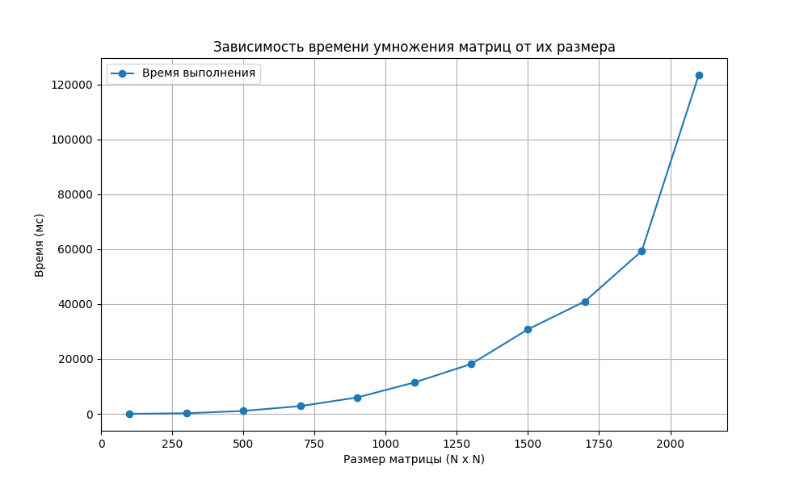

# Лабораторная работа №1

Яковлева Яна Анатольевна, 6313-100503D

**Задание на лабораторную работу** Написать программу на языке C/C++ для перемножения двух матриц.
Исходные данные: файл(ы) содержащие значения исходных матриц.
Выходные данные: файл со значениями результирующей матрицы, время
выполнения, объем задачи.
Обязательна автоматизированная верификация результатов вычислений с помощью
сторонних библиотек или стороннего ПО

### График производительности  
  
Теоретическая кривая O(n³) согласуется с результатами, полученными на практике. С увеличением размера матрицы время выполнения операции умножения двух матриц пропорционально кубу 

**Выводы**  
    Для матриц до 900×900 результаты C++ и NumPy совпадают с высокой точностью, но с 1100×1100 пошли расхождения. Они связаны с разными алгоритмами оптимизации, также имеет место погрешность результатов. 