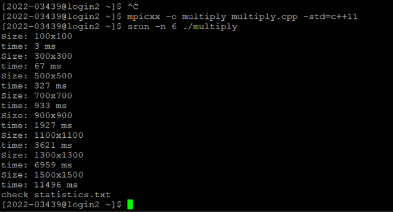
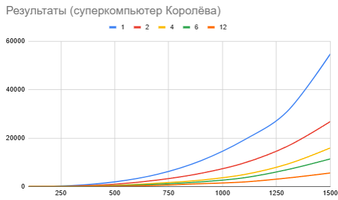
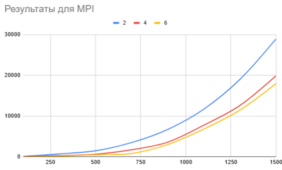
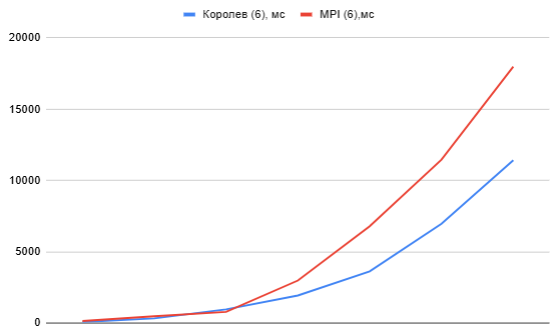

# Лабораторная работа №3

Яковлева Яна Анатольевна, 6313-100503D

**Задание на лабораторную работу** Модифицировать программу из л/р №1 для параллельной работы по
технологии MPI. В папке results представлены результаты умножения, multiply.cpp — программа для перемножения двух матриц

### Результаты работы

Пример запуска программы на суперкомпьютере Королёва — через программу-эмулятор терминала PuTTY, обмен данными происходит через WinSCP. Были запущены и записаны резульаты для 1,2,4,6,12 процессов.

### График зависимости от количества процессов

Обычные измерения проводились на 2,4,6 процессах.

Для примера сравним на графике результаты работы на 6 процессах:

На основе результатов можно сделать вывод, что MPI обеспечивает значительное ускорение, а использование суперкомрьютера сократило время выполнения вычислений. С увеличением размера матрицы время выполнения также сокращается. На малых матрицах могут быть «искажения» в силу того, что появляются накладные расходы. MPI выгоднее использовать в распределенных системах (например, суперкомпьютер), а OpenMP хорошо работает при общей памяти (многоядерные CPU) 

